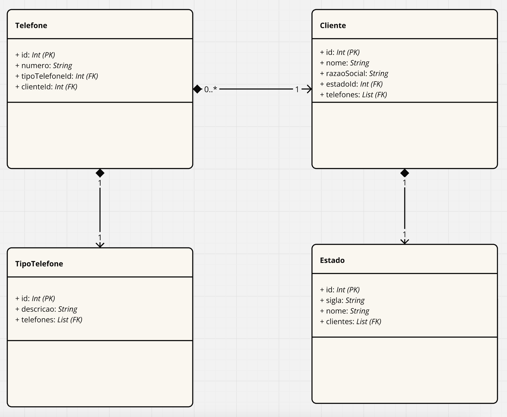

# Desafio Desenvolvedor Target Sistemas

Este repositório contém a resolução das questões propostas para o desafio de desenvolvedor da Target Sistemas.

## Link para o Desafio

- [Repositório do Desafio](https://github.com/allandefranca/desafio-desenvolvedor-targetsistemas.git)

## Questão 1: Soma

- Resultado: **77**

- 

## Questão 2: Sequências

a) **1, 3, 5, 7, 9**  
   Lógica: Sequência de números ímpares.

b) **2, 4, 8, 16, 32, 64, 128**  
   Lógica: Cada número é o dobro do anterior.

c) **0, 1, 4, 9, 16, 25, 36, 49**  
   Lógica: Sequência de quadrados perfeitos (0², 1², 2², 3², ...).

d) **4, 16, 36, 64, 100**  
   Lógica: Sequência de quadrados perfeitos, começando com 2² (2², 4², 6², 8², 10²).

e) **1, 1, 2, 3, 5, 8, 13**  
   Lógica: Sequência de Fibonacci, onde cada número é a soma dos dois anteriores.

f) **2, 10, 12, 16, 17, 18, 19, 20**  
   Lógica: A sequência alterna entre adicionar números (primeiro +8, depois +2) e depois continua adicionando 1 a partir de 17.

## Questão 3: Faturamento Diário

Considerando o vetor `faturamentoDiario`:

```javascript
const faturamentoDiario = [
  1000, 2000, 3000, 0, 1500, 0, 0,
  4000, 3500, 5000, 0, 0, 2000, 0,
  0, 2500, 3000, 4500, 0, 0, 0,
  500, 600, 0, 7000, 1000, 0, 0,
  200, 1500, 2500, 0, 0, 0, 0
];
```
- Menor faturamento: 200
- Maior faturamento: 7000
- Dias com faturamento acima da média: 7

- 

## Questão 4: Banco de Dados

Para a resolução desta questão, utilizei o Prisma com SQLite para facilitar a criação e validação dos dados.

- 
- 

```sql
SELECT c.id, c.razao_social, t.numero
FROM Clientes c
JOIN Telefones t ON c.id = t.cliente_id
JOIN Estados e ON c.estado_id = e.id
WHERE e.sigla = 'SP';
```

## Questão 5: Cálculo de Encontro de Veículos

1. Definições de constantes (distância total, velocidade do carro, velocidade do caminhão, tempo de pedágio).

2. Cálculo do tempo de encontro.

3. Cálculo da distância percorrida por cada veículo (considerando paradas no pedágio do carro).

4. Cálculo do quilômetro em que os veículos se cruzam.

Distância do carro até Ribeirão Preto: 88.68 km
Distância do caminhão até Ribeirão Preto: 36.32 km

5. Determinação do veículo mais próximo de Ribeirão Preto no momento do cruzamento.

Quando eles se cruzarem, o caminhão estará mais próximo de Ribeirão Preto.

- 
